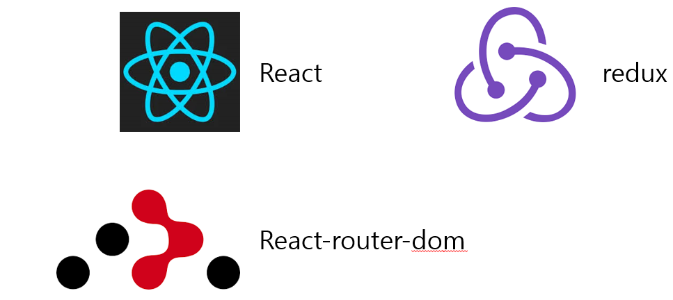

# React로 쇼핑몰 구현

# React를 사용한 쇼핑몰 구현

### 프로젝트 개요

React와 redux를 활용하여 간단한 쇼핑몰 구현

### 핵심 기능

**🥼상품 상세보기 기능**

**📥장바구니 추가 기능**

**📜장바구니에서 상품 추가, 삭제 및 갯수 변경**

### 인원

- 정상필 외 2인

### GitHub

[GitHub - JungBear/react-semi-project](https://github.com/JungBear/react-semi-project)

## 🛠️ 개발 환경

### 주요 기능

<aside>
💡 **상품 목록 페이지**

</aside>

<aside>
💡 **상품 상세 페이지**

</aside>

<aside>
💡 **장바구니 페이지**

</aside>

### 어려웠던 점

- redux를 사용하여 전역 상태 관리를 진행 할 때 `어떻게`에 대한 정보가 많이 부족했다. → 공식 사이트를 읽어보고 튜토리얼을 따라가면서 개념을 많이 잡았고, 그를 활용해 진행하였다

### 느낀점

- 리액트를 왜 사용하는지 직접 프로젝트를 진행해보니 알게 되었고, 리액트에 대해 매력을 느껴 리액트에 대해 공부를 더 해봐야겠다 라고 생각이 들었습니다.